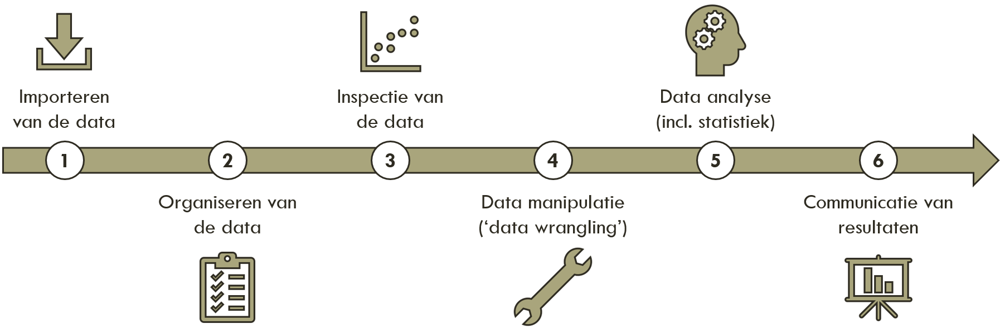

# Data science bij het ILC

Bij biologie komt steeds meer data kijken.

Daar leiden we studenten ook voor op.

Deze pagina biedt een overzicht van de data science vakken, onderwerpen en mogelijkheden bij ILC, voor zowel studenten als docenten.

## Data analyse stappenplan

Stel , je hebt een interessante (biologische) vraag die je wilt beantwoorden. Je formuleert een hypothese, die je gaat testen met een wetenschappelijk experiment. Uit ieder wetenschappelijk experiment komt data. Een belangrijke stap is om de data te verwerken en te interpreteren zodat je inzicht krijgt in het proces dat je wilt bestuderen: klopt de hypothese, wordt de hypothese verworpen of moet de hypothese bijgeschaafd worden. Zonder een gedegen data analyse loop je vast en kan je niet verder met het genereren van nieuwe hypotheses en wetenschappelijke experimenten! 

**Zonder data analyse geen wetenschap!**

Data analyse verloopt volgens een aantal algemene stappen, eigenlijk in een cyclus.

Deze stappen vormen de kapstok binnen alle cursussen van de leerlijn bioinformatica.

## Open science

Vinden wij hip, hoera

## links naar cursuspagina's

here be direct links